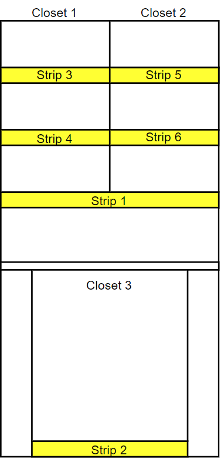
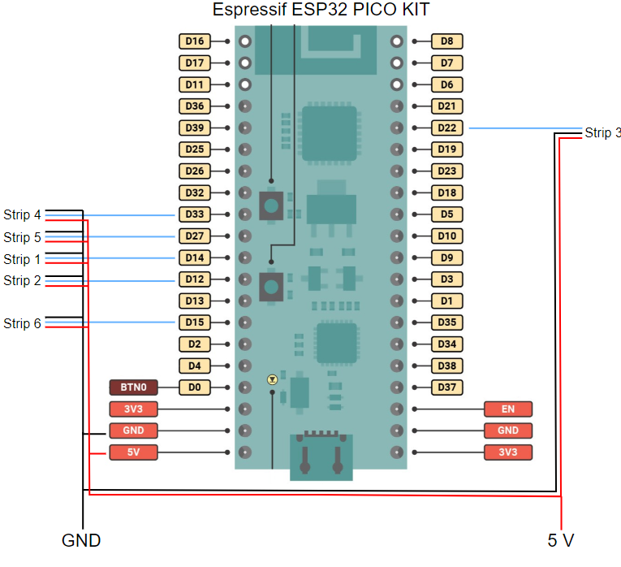

# Smart Lights Module

Smart light module for Kitchen

## Authors

Íris Lisboa (Original Developer) & Jorge S. Calado (Supervisor)

## Hardware Requirements
 - ESP32 Pico Kit: https://pt.mouser.com/ProductDetail/Espressif-Systems/ESP32-PICO-KIT?qs=MLItCLRbWsyoLrlknFRqcQ%3D%3D
 - Breadboard: https://www.electrofun.pt/prototipagem/breadboard-arduino-830-pontos
 - WS2812 Leds: https://www.ptrobotics.com/neopixel/7834-fita-led-rgb-ws2812b-60-5050-5v-black-1mt.html
 - 5V power supply to power the esp32 and the led strips

## Required Libraries
 - FastLED.h
 - PubSubClient.h
 - WiFi.h
 - SPI.h
 - BlockNot.h

## Other Requirements
 - MQTT Broker - see MQTT Specs 

## Installation/Getting Started
This module consists of 6 led strips connected to the ESP32 to assist users when getting food from the kitchen

The set-up should be as follows:<br>



Each of the led strips is connected to a pin in the ESP32. The WS2812 led stripshave three pins: Vin, GND and Din.
The Vin pins should be connected to a power supply of 5V, the GND can be connected to the boards GND pin, and finally the Din pin should be connected to a respective ESP32 pin. 

The schematics for the project are as follows:<br>


## Configuration

 - In the secrets.h file the network ssid and password must be updated to the respective network configurations
 - Define the ```#define LED_PIN``` for the strip 1 leds
 - Define the ```#define LED_PIN_1``` for the strip 3
 - Define the ```#define LED_PIN_2``` for the strip 2 leds
 - Define the ```#define LED_PIN_3``` for the strip 3 leds
 - Define the ```#define LED_PIN_4``` for the strip 5 leds
 - Define the ```#define LED_PIN_5``` for the strip 6 leds
 - Configue the MQTT broker ```const char* server```

 - Change the number of leds from strip 1 with ```#define NUM_LEDS``` and the number of sections ```#define NUM_SEC```
If the ```NUM_LEDS``` and ```NUM_SEC``` variables are changed, then the ```main_led_map[]``` variable must also be updated with the number of sections and number of leds per section.<br>

 - Change the number of shelfs with ```#define NUM_STRIPS```, if this variable is updated then tehre are some other parameters that must be updated. The ```#define NUM_LEDS_PER_STRIP``` That dfeines the number of leds per shelf. As well as ```#define NUM_LEDS_1``` that keeps the total number of leds and ```#define NUM_SEC_1``` that refers to the total number of sections across shelfs.

 - When the number of shelfs or number of sections across shelfs changes the ```int shelfColor[NUM_SEC_1][3]``` must be updated to match the number of sections. This variable represents the RGB code of each shelf section.
 - The ```int sec_led_map[NUM_SEC_1]``` represents the number of leds per section of shelf across all shelfs

## Features

 - 6 color mood service in the main led strip(strip 1)
 - Identification of sections across shelves and closets
 - Blinking service to warn opening/closing doors
 - Connection to a voice control module

->Check MQTT specs for more details
